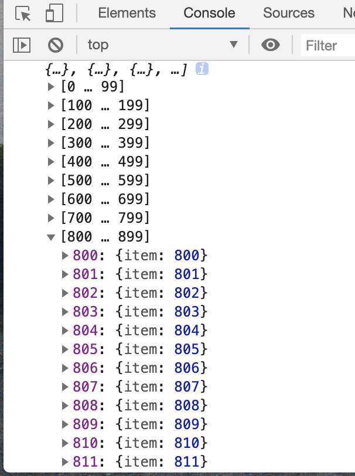
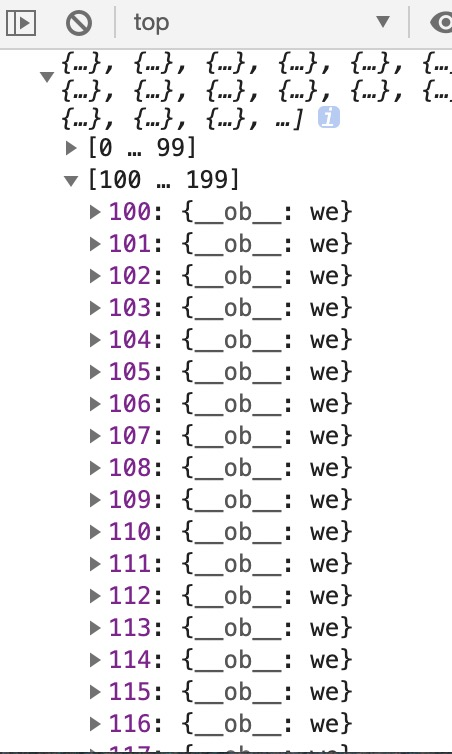

# Vue的小技巧

::: tip 标题
今天在掘金上看见大佬[skinner](https://juejin.im/post/5ce3b519f265da1bb31c0d5f)分享的一些Vue技巧自己学习一下，记录学习笔记
:::

### 1. observable跨组件状态存储

- `vue 2.6新增` [官网](https://cn.vuejs.org/v2/api/index.html#Vue-observable)上这样介绍的跨组件状态存储，我的理解 就感觉很像一个小型的Vuex。[完整代码](https://github.com/hz199/__/blob/master/html/vue/vue.Observable.html)

```html
<div id="app">
  <!-- 这个 参数放在data 不会更新 -->
  <div>{{dataNumber}}</div>
  <div>{{dataNumberA}}</div>
  <button @click="setCount">点击</button>
</div>

```

```js
// 创建 store
const store = Vue.observable({
  count: 1
})

//  创建 mutations
const mutations = {
  setCount() {
    store.count += 1
  }
}

new Vue({
  el: '#app',
  data() {
    return {
      dataNumber: store.count  // 不放在计算属性里面的store 参数是不具备响应数据的，只有放在 计算属性 `computed` 内`store.count`数据改变 触发页面更新
    }
  },
  computed: {
    dataNumberA: () => store.count
  },
  methods: {
    setCount: mutations.setCount
  }
})
```

### 2.禁止数据劫持

```js
let arr = []
for (let i = 0; i < 1000; i++) {
  arr.push({
    item: i
  })
}

new Vue({
  el: '#app',
  data() {
    return {
      messageArr: []
    }
  },
  mounted () {
    this.messageArr = Object.freeze(arr)
    console.log(this.messageArr)
  }
})
```
- 使用`Object.freeze` 数据未被劫持


- `this.messageArr` 直接赋值 每一个子对象都会被劫持


### 3. @hook:事件= ""
- 在父组件中接收，子组件的 mounted 调用 处理一些事情~~

```html
<Child @hook:mounted="doSomething"/>
```